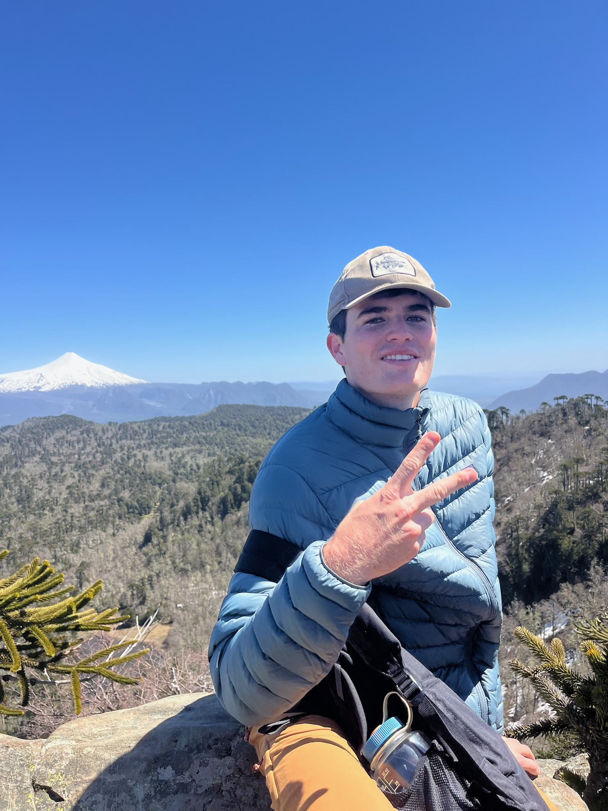
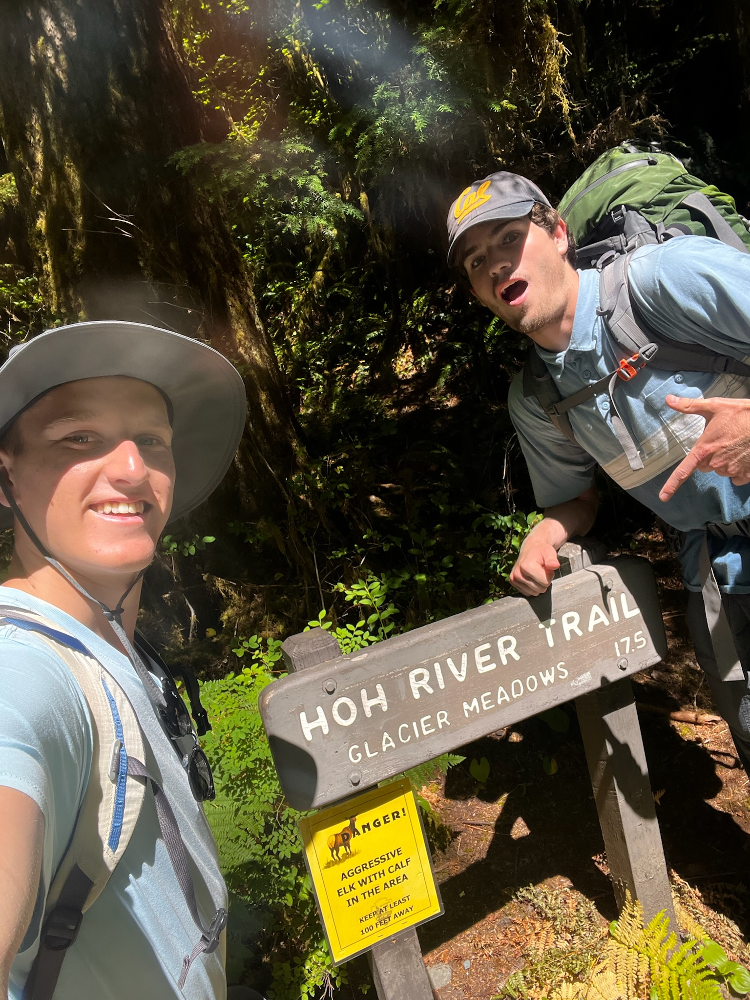

::: {layout="[[1, 1, 1]]"}
{width="375"}

{group="aa" description="Backpacking in Washington" width="375"}

{width="375"}
:::

## Hobbies

I’m passionate about spending time outdoors, especially hiking, backpacking, and exploring nature whenever I can. I also enjoy giving back to my community through volunteer work with the Isla Vista Community Services District and Sprout Up, where I help support local initiatives and environmental education. Staying active is important to me, and I love playing sports like tennis and basketball. Whether I’m on the trail, on the court, or volunteering in the community, I value experiences that keep me engaged, active, and connected with others.

## Academic and Career Interests

As an undergraduate at the University of California, Santa Barbara studying Hydrologic Sciences and Policy, I am interested in understanding how water systems function and how they can be managed more sustainably. My academic focus centers on California’s complex water systems and the policies that shape how water resources are allocated and protected. I am particularly interested in groundwater hydrology and the role groundwater plays in long term water security. In the future, I hope to work on water management challenges that support sustainable and resilient use across California.

## Community Involvement

I enjoy being involved in both community service and campus organizations that connect with my interests. I volunteer with the Isla Vista Community Services District, supporting community initiatives that benefit local residents and promote a healthy environment. I am also involved with Sprout Up, where I help teach environmental education to elementary school students. On campus at the University of California, Santa Barbara, I am a member of the Hydrology Club and the Recreational Tennis Club, which allow me to connect with peers who share my academic interests and enjoyment of staying active.
