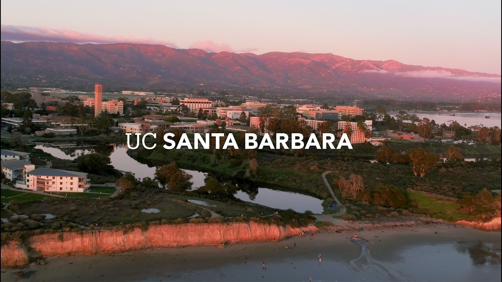

## Groundwater Hydrology

Description: Analysis of groundwater flow in complex geologic environments, aquifer properties, wells and groundwater contamination, surface water-groundwater interactions. The laboratories included basic groundwater experiments, Darcy's law, flow nets, solute dispersion, field measurements of bedrock groundwater, analysis of pumping-test data.

## Statistics for Environmental Science

Description: Course included descriptive statistics, analyzing differences between populations, hypothesis testing, regression analysis, and types of bias. Basic concepts and associated skills, such as R coding, were taught, drawing on examples and data from environmental science topics.

## Introduction to Climate Modeling

Description: An introduction to climate models and their application to studies of past, modern, and future climate. Learned fundamental modeling concepts, gained experience running several kinds of models, with emphasis on atmosphere-ocean General Circulation Models (GCMs) and "simple"(zero-dimensional) models.

## Geographic Information Systems (GIS) for Environmental Applications

Description: Explored how Geographic Information Systems (GIS) can help analyze and communicate the spatial patterns underpinning a wide variety of environmental concerns. Introduced to the basic theory and application of GIS through hands-on application of the technology to environmental questions.
